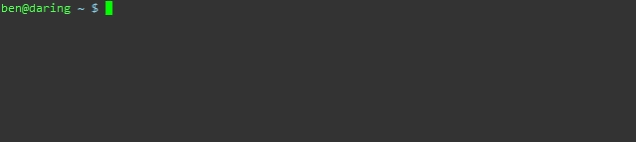

HoldThis
========

Holds directory bookmarks allowing access from any terminal

To install clone the repo and make sure you have atleast go 1.1 installed.

Then run `./setup`

Once installed there are 3 commands.
  * jump
    * This command jumps to a presaved place that was stored in `hold`
  * hold
    * This command saves the current place as the name that is passed to is
  * jumplist
    * Lists all the places that are saved in the database.
